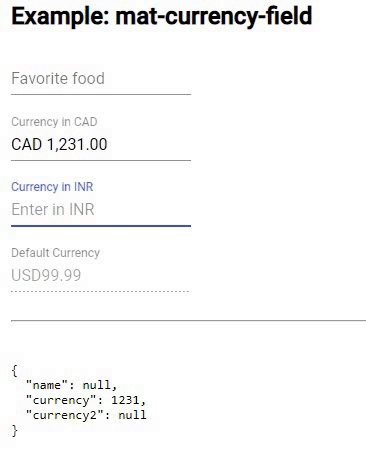

# @aipeel/mat-currency-field

Angular Material based currency field. Works with material form field.



## Installation
```
npm install @aiplee/mat-currency-field --save
```

## Usage
<pre>
    &lt;mat-form-field&gt;
      &lt;mat-label&gt;Currency in CAD &lt;\/mat-label&gt;
      
     <span style="background: lightblue; font-weight: bold">&lt;mat-currency-field  formControlName="currency" 
                          placeholder="Enter in CAD" 
                          currencyCode="CAD"&gt;
     &lt;/mat-currency-field&gt;</span>

      &lt;mat-error *ngIf="frm.controls.currency.hasError('pattern')"&gt;
        Invalid Format
      &lt;/mat-error&gt;
    &lt;/mat-form-field&gt;
</pre>